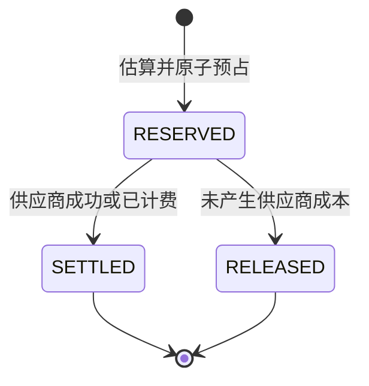

# 租户下子用户配额与成本管理

## 1. 目标与非目标

配额只解决企业租户内部的子用户成本控制和成本归集：

- 防止单个子用户异常消费；
- 让租户管理员按用户、角色查看和控制模型积分；
- 在模型、供应商计费方式不同的情况下使用统一积分比较成本；
- 对每次成功调用保留可追溯的费率快照、原始 Usage 和积分。

本模块不管理 tenant 总池、供应商赠送额度、PAID/FREE/TRIAL、SYSTEM/CUSTOM 偏好或凭据降级。供应商选择由模型配置与路由负责，用户配额不得改变实际模型和 API Key。

## 2. 策略优先级

| 优先级 | 来源 | 用途 |
| --- | --- | --- |
| 1 | 用户 LIMITED / UNLIMITED / DISABLED 覆盖 | 风险用户限流、白名单或立即停用 |
| 2 | 用户显式指定模板 | 给单个用户绑定特殊周期模板 |
| 3 | 最高优先级角色模板 | 对 developer、analyst 等角色批量配置 |
| 4 | 租户默认模板 | 新用户自动继承，无需逐人初始化 |
| 5 | 平台默认每月 100 积分 | 未配置时自动获得基础额度并持续记成本 |

角色由宿主鉴权系统通过 `CallerIdentity.roles` 传入。相同优先级的角色按 `role_code` 升序选择，结果可复现。

## 3. 积分计量

每个 `tenant_id + configured_model_id` 可配置：

- `per_request_credits`
- `input_credits_per_1k`
- `output_credits_per_1k`
- `billable_unit_credits`

模型未配置时使用 1 积分/次。所有金额使用 `Decimal` 与数据库 `NUMERIC(20,6)`。调用预占时把规则写入 `rate_snapshot`，结算和历史查询不读取最新费率。

## 4. 调用状态机



预占条件为：

```text
credits_used + credits_reserved + estimated_credits <= credit_limit
```

显式无限额度的 `credit_limit` 为 `NULL`；完全未配置时使用每月 100 积分的平台默认策略。预占和结算均以 `invocation_id` 为幂等键。实际用量可能高于预估，系统会如实把差额计入 `credits_used`，并在下一次调用前阻断。

异常边界：

- 供应商调用前或调用失败：释放预占；
- 阻塞调用成功：按供应商 Usage 结算；
- 流式开始输出后取消或异常：有 Usage 用实际值，否则用预估值结算；
- 供应商已响应但制品入库失败：仍按实际或预估值结算；
- 异步任务受理：保持 RESERVED，任务回调/轮询器最终调用 `finalize_async_quota`。

## 5. 周期和状态

当前支持 UTC 自然日 `DAY` 和 UTC 自然月 `MONTH`。每个周期保存当时的策略来源、硬上限、已用和在途积分。策略修改不会清空当前周期的消费。

| 状态 | 判定 |
| --- | --- |
| `UNLIMITED` | `credit_limit IS NULL` |
| `DISABLED` | 用户分配记录 `enabled=false` |
| `EXCEEDED` | 已用 + 在途达到硬上限 |
| `SOFT_LIMIT` | 已用 + 在途达到软阈值但未到硬上限 |
| `ACTIVE` | 其他可用状态 |

## 6. 数据表

| 表 | 作用 |
| --- | --- |
| `model_credit_rate` | 模型到统一积分的换算规则 |
| `user_quota_template` | 日/月模板、软阈值和默认标记 |
| `user_quota_role_binding` | 外部角色代码到模板的映射 |
| `user_quota_assignment` | 用户模板或 LIMITED/UNLIMITED/DISABLED 覆盖 |
| `user_quota_period` | 当前与历史周期累计量 |
| `user_quota_reservation` | 调用级预占、Usage 估算和费率快照 |
| `user_cost_ledger` | 成功/已计费调用的不可变成本台账 |
| `user_quota_audit` | 管理员变更前后值审计 |

用户、组织和角色表不属于本库。`tenant_id` 和 `user_id` 是平台身份服务提供的外部稳定标识。

## 7. 权限

- 配置模型费率、模板、角色绑定和用户分配：仅 `tenant_admin`；
- 查询本人：身份 tenant/user 必须与目标一致；
- 查询租户内其他用户或整个租户：仅 `tenant_admin`；
- 服务身份调用模型也必须传 `context.user_id`，用于 on-behalf-of 成本归集。

所有管理写操作写入 `user_quota_audit`，不会记录 API Key 或 Prompt。

## 8. 并发和运维

- 容量检查使用数据库条件 UPDATE，不依赖进程锁或 Redis；多实例共享数据库时不会超卖预占。
- Redis 可以用于查询缓存，但不能作为额度事实源。
- 应由宿主任务定期扫描长期 RESERVED 的异步任务；只有确认供应商未计费才能 RELEASED。
- v0.3 不再读取旧供应商配额表。迁移 005 是非破坏性的；确认 v0.2 无回滚需求后再删除旧表。
